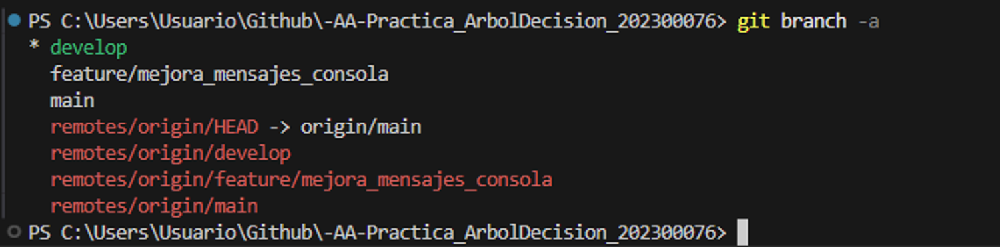
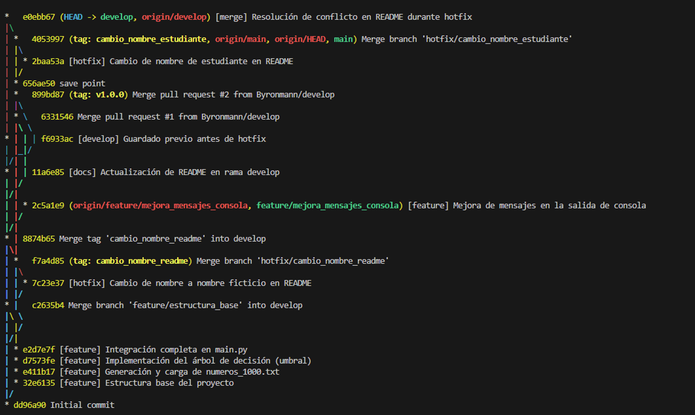
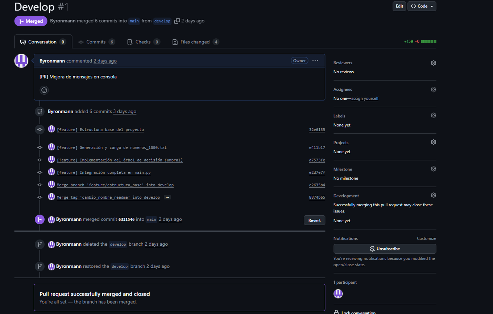
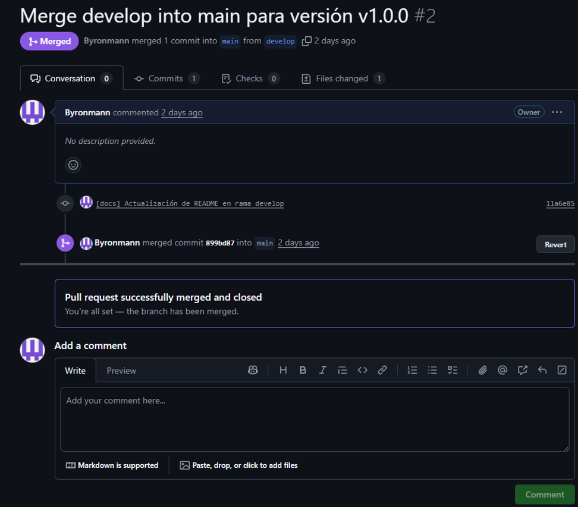
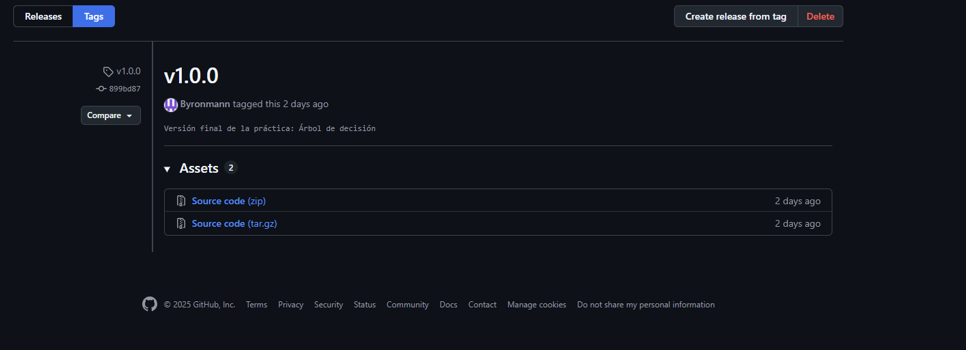
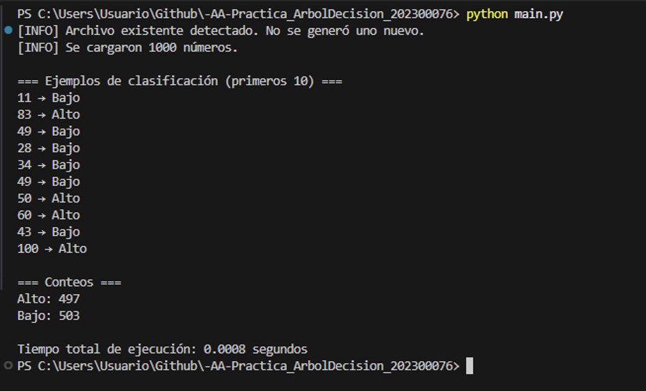
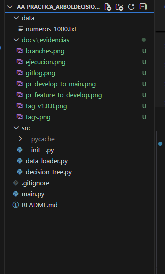
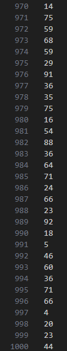

# [AA]Practica_ArbolDecision_202300076

## Portada

**Universidad:** Universidad Da Vinci de Guatemala  
**Facultad:** Ingeniería en Sistemas  
**Curso:** Análisis de Algoritmos  
**Práctica:** Árbol de Decisión simple en Python  
**Estudiante:** Byron Rodolfo Maldonado Palacios  
**Carnet:** 202300076
**Docente:** Ing. César Dionicio Sazo Mayen  
**Fecha:** 16 de noviembre de 2025  

---

## Objetivo general

Construir y ejecutar un árbol de decisión simple en Python (sin librerías externas) para clasificar números como “Alto” o “Bajo” a partir de un umbral, aplicando de forma rigurosa el flujo de trabajo Gitflow (ramas, commits, PRs, merges y versionado).

## Objetivos específicos

- Implementar un árbol de decisión minimalista con 1 solo nodo de decisión (umbral) y 2 hojas (“Bajo” / “Alto”).  
- Leer un archivo TXT con 1000 números y clasificarlos según el umbral.  
- Generar salidas claras en consola con ejemplos, conteos y tiempo total de ejecución.  
- Aplicar Gitflow con ramas `feature/*` y `hotfix/*`, commits significativos, pull requests y merges hacia `develop` y luego a `main`.  
- Documentar el proyecto con docstrings (PEP-257) y un README.md claro.

---

## Descripción del árbol de decisión

El árbol de decisión utilizado en esta práctica es **minimalista**:  
- Tiene **un único nodo de decisión**, que compara el número con un umbral.  
- El umbral por defecto es `50`, aunque se puede modificar con el argumento `--umbral`.  
- Las dos hojas posibles son:  
  - **“Alto”** si `número >= umbral`.  
  - **“Bajo”** si `número < umbral`.  

Este árbol no tiene más niveles ni ramas adicionales; toda la lógica se concentra en esa comparación simple.

---

## Metodología

### Flujo del script (`main.py`)

1. **Lectura de argumentos**  
   - Se utiliza `argparse` para leer el parámetro opcional `--umbral`.  
   - Si no se especifica, el umbral por defecto es `50`.

2. **Inicio del cronómetro**  
   - Se toma el tiempo inicial con `time.time()` para medir el tiempo total de ejecución.

3. **Verificación / generación del archivo de datos**  
   - Se llama a `asegurar_archivo_numeros()` del módulo `src/data_loader.py`.  
   - Si `data/numeros_1000.txt` no existe, se genera automáticamente:  
     - 1000 números enteros aleatorios entre 1 y 100.  
     - Se registra y muestra la **semilla** utilizada.  
   - Si el archivo ya existía, se reutiliza sin modificarlo.

4. **Carga de los números**  
   - Se llama a `cargar_numeros()` para leer todos los enteros del archivo.  
   - Se valida que cada línea sea un entero válido.

5. **Clasificación con el árbol de decisión**  
   - Se invoca `clasificar_lista()` del módulo `src/decision_tree.py`.  
   - Cada número se clasifica como “Alto” o “Bajo” según el umbral configurado.

6. **Impresión de resultados**  
   - Se muestran en consola los **primeros 10 números** con su clasificación.  
   - Se cuentan cuántos resultados fueron “Alto” y cuántos “Bajo”.  
   - Se imprime el resumen de conteos.

7. **Cálculo del tiempo total**  
   - Se toma el tiempo final con `time.time()` y se calcula la diferencia.  
   - Se imprime el tiempo total de ejecución en segundos.

### Flujo Gitflow utilizado

1. Inicialización de Gitflow con ramas por defecto (`main`, `develop`, `feature/`, `hotfix/`).  
2. Creación de una rama `feature/estructura_base` para la estructura del proyecto y la lógica principal.  
3. Commits significativos para:  
   - Estructura base del proyecto.  
   - Generación y lectura de `numeros_1000.txt`.  
   - Implementación del árbol de decisión.  
   - Mejoras de salida en consola.  
4. Creación y finalización de un **hotfix** `hotfix/cambio_nombre_readme`, cambiando el nombre del estudiante en el README a un nombre ficticio.  
5. Creación de un **Pull Request** desde una rama `feature/*` hacia `develop`.  
6. Creación de un **Pull Request** desde `develop` hacia `main` para la versión estable.  
7. Creación del **tag** de versión final: `v1.0.0`.

---

## Resultados

> **Nota:** Los valores dependen del archivo generado y de la semilla utilizada.  
> A continuación se muestra un ejemplo de ejecución con umbral 50:

- **Ejemplos de clasificación (primeros 10):**  
  ```text
  23 → Bajo
  67 → Alto
  50 → Alto
  12 → Bajo
  89 → Alto
  34 → Bajo
  76 → Alto
  41 → Bajo
  58 → Alto
  3  → Bajo
---
## Evidencias del Proyecto

A continuación se presentan las evidencias solicitadas en la práctica, almacenadas en  
`docs/evidencias/`.

### 1. Ramas locales y remotas (`git branch -a`)


### 2. Historial de commits (`git log --oneline --decorate --graph`)


### 3. Pull Request: feature → develop


### 4. Pull Request: develop → main (versión final)


### 5. Tag de versión final `v1.0.0`


### 6. Ejecución del programa (`python main.py`)


### 7. Estructura del proyecto (carpetas y archivos)


### 8. Archivo generado: `data/numeros_1000.txt`


## Conclusiones

La práctica permitió aplicar el flujo de trabajo Gitflow de forma correcta, utilizando ramas feature, develop, main y hotfix, además de realizar commits claros, pull requests y merges controlados.  
Se comprendió cómo un árbol de decisión simple puede clasificar datos utilizando únicamente un umbral como nodo principal.  
Además, reforcé el uso de control de versiones, la resolución de conflictos, la creación de tags y la documentación de un proyecto profesional mediante un README completo.  
Este ejercicio fortaleció habilidades prácticas de desarrollo y buenas prácticas en control de versiones, fundamentales en entornos de trabajo reales.

## Referencias

- Git Documentation: https://git-scm.com/docs  
- Gitflow Workflow (Atlassian): https://www.atlassian.com/git/tutorials/comparing-workflows/gitflow-workflow  
- Python documentation: https://docs.python.org  
